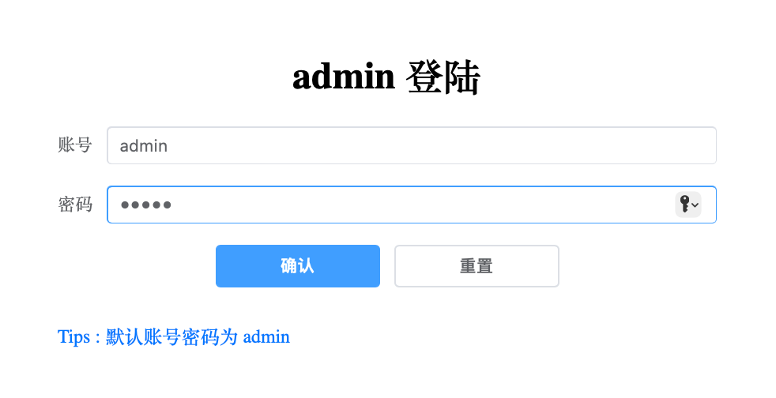
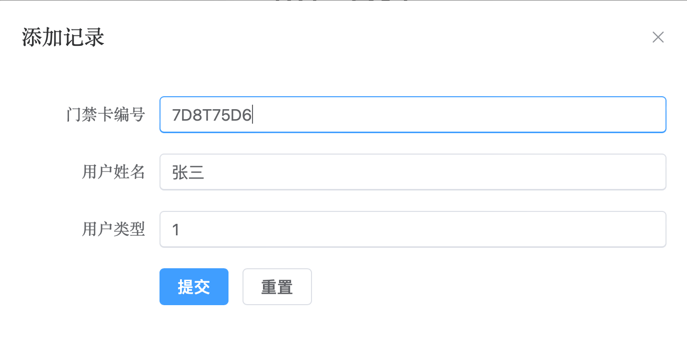
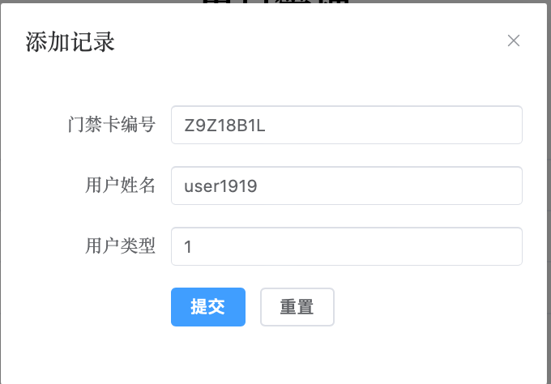
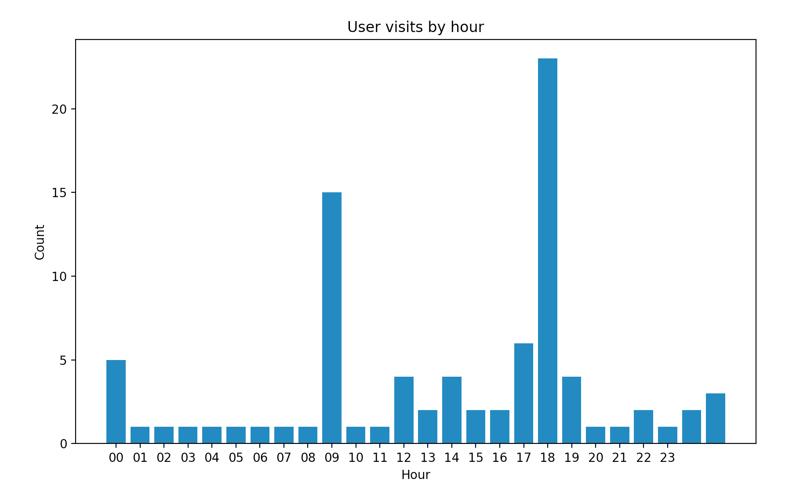
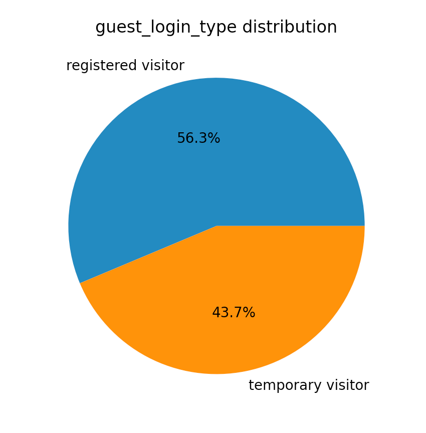
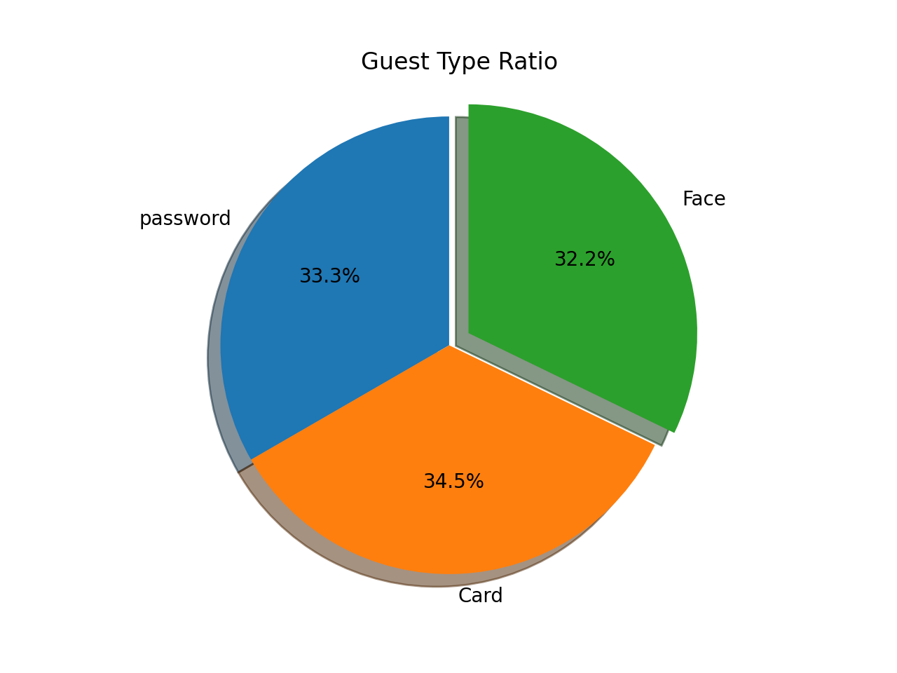

# IoT智门口道监控系统设计文档

本项目为针对`2023年全国大学生物联网设计竞赛/命题2（安谋科技命题）/IoT智门口道监控系统`编写的管理系统。
使用 flask + sqlite 实现后端与数据库，vue + element plus 实现前端。
使用 orangepi 5 作为服务器，使用 MM32F5270 作为主控芯片。

在下面的比赛规则中，对实现的功能加粗显示：

* 使用 MM32F5270 微控制器作为主控芯片。
* 使用MindSDK或MicroPython作为软件开发平台。
* 通过中远距离接近传感器（毫米波雷达、dToF、红外接近传感器、摄像头或其他），检测是否有人通过门口的检测区域（暂定义为前后1-2M范围，模拟一个走廊）使得灯光亮起照射检测区域。
* 在门口刷卡、**密码正确则可开门**。
* 监控系统在门口停留超过10秒后发出警告，并通过无线通信网络传输模块（4G、Wifi、BLE、ZigBee等），**将监控数据上传至云端。**
* **云端数据库保存每次开门、警报的记录。**
* 加分项：通过语音警告、实现云台的自动跟随、**捕获图像数据上传至云端、捕获图像数据保存在本地、通过微信小程序或者网页在云端实现超控等。**

## 使用方法

前端使用

1. 安装 node.js
2. 进入 front-end 文件夹
3. 运行 `npm install` 安装依赖
4. 运行 `npm run dev` 启动前端

后端使用

1. 安装 python3
2. 运行 `pip install -r requirements.txt` 安装依赖
3. 运行 `flask create` 初始化数据库
4. 运行 `flask run` 启动后端

API 使用

本项目使用 RESTful API，使用 GET、POST、DELETE 等方法进行数据的增删改查。
`GuestAPI` 用于访客的增删改查，`UserAPI` 用于用户的增删改查，`AlarmAPI` 用于警报的增删改查。

使用`GuestAPI` 的 GET 方法，直接 `serverip:5000/guest` 即可获取所有访客的信息，输入`serverip:5000/guest/1` 即可获取 id 为 1 的访客的信息。
使用`GuestAPI` 的 POST 方法，数据格式如下

```json
{
    "card_number": "114514",
    "guest_name": "王爷",
    "guest_type": "1",
    "guest_login_type": 1
}
```

使用`GuestAPI` 的 PUT 方法，可以更新或编辑访客记录，数据格式如下

```json
{
    "card_number": "114514",
    "guest_name": "王爷",
    "guest_type": "1",
    "guest_login_type": 1
}
```

使用`GuestAPI` 的 DELETE 方法，可以删除访客记录，数据格式如下

```json
{
    "card_number": "114514",
    "guest_name": "王爷",
    "guest_type": "1",
    "guest_login_type": 1
}
```

需要注意的是，`guest_time` 会自动填充为当前时间，不需要写在json中。PUT 和 DELETE 方法，是针对前端编写的，建议不要使用。

使用`UserAPI` 的 GET 方法，直接 `serverip:5000/user` 即可获取所有用户的信息，输入`serverip:5000/user/1` 即可获取 id 为 1 的用户的信息。
使用`UserAPI` 的 POST 方法，可以创建新用户，数据格式如下

```json
{
    "card_number": "114514",
    "user_name": "王爷",
    "user_type": "1"
}
```

使用`AlarmAPI` 的 GET 方法，直接 `server:5000/alarm` 即可获取所有警报的信息，输入`serverip:5000/alarm/1` 即可获取 id 为 1 的警报的信息，输入`serverip:5000/alarm/1/file` 即可获取 id 为 1 的警报的图片。
使用`AlarmAPI` 的 POST 方法，直接上传图片文件，支持 jpg/jpeg/png，即可以创建新警报。例如，使用 curl 命令：`curl -F "image=@1.png" http://serverip:5000/alarms` 即可上传 1.jpg 文件，创建新警报。`alarm_time` 会自动填充为当前时间。PUT 和 DELETE 方法的使用方法类似，是针对前端编写的，同时部分功能缺失，感觉也没有使用的必要，建议不要使用。

## 摘要

本IoT智能门口监控系统旨在提供一种智能化和现代化的区域边缘的安防解决方案，旨在提升住宅、公寓和学校企业门口的安全性，便利性和智能化程度。该系统结合了基于灵动微电子MM32F5270，ESP32和RK3588S，为用户提供全方位的实时监控和智能管理功能。

本系统可以提供以下功能：门禁管理，访客管理，告警系统，网页管理，实时监控和监控存储的功能。

本系统可以运用于学校，居民住宅，企业等需要对外来人员进行管控的区域，也可以适用于较小的区域，例如实验室，寝室等。相较于传统方案，我们的方案更加智能化。考虑现在这些区域更加复杂的人员管理要求，我们提供了输入密码，ic卡，人脸识别多种通过手段。

本系统创意来源于生活中的门禁系统智能化程度低，验证方式单一，对于用户的体验相对不佳。

关键词：iot，物联网，RFID，嵌入式

## 第一章 设计需求分析

>（本章节主要描述面向什么需求设计了本作品，本作品主要解决了什么问题，或对什么现有产品或应用作出了改进等）

### 1.1 设计需求

在考虑了用户需求和现有系统的不足后，本系统设计时候需要考虑智能化功能，安全性，可靠性，易用性，扩展性和性能。

#### 1.1.1 智能化和功能需求

本系统可以需要提供多种方式进行验证，例如rfid卡，直接输入密码或者人脸识别。

本系统同时需要含有对通过中远距离接近传感器，检测是否有人通过门口的检测区域，并使得灯光亮起照射检测区域。

本系统的监控系统在门口停留超过10秒后发出警告，并通过WIFI，将监控数据上传至云端。

本系统同时需要一个管理系统，用于获取和更改开门记录，用户数据，可以用于授权进门的用户。该管理系统还有纪录门前图像系统，一个可以实时查看门卡图像的监控系统

#### 1.1.2 安全性需求

需要确保系统验证方式可以保证是在允许名单内的人员，后台管理系统需要通过密码等安全验证才能访问。

#### 1.1.3 可靠性需求

本系统需要具有一定的稳定性，降低系统崩溃或故障的概率。具有一定容错性，系统应具备一定的容错能力，即使在部分组件故障的情况下，也能保持基本功能运作。

#### 1.1.4易用性需求

本系统具有用户友好的界面，设计直观、易于操作的用户界面，使未经过培训的管理员也能轻松管理系统。

#### 1.1.5 扩展性需求

本系统支持多套设备接入：系统支持连接多个摄像头和传感器，以覆盖更广泛的监控区域。具有开放式接口和API，便于未来集成其他智能设备和系统。

#### 1.1.6 性能需求

验证系统的反应速度符合人对机器速度的普遍认知，监控系统回传延迟控制在10s内，清晰度具有480P以上水平，单张图片具有1080P清晰度。

## 第二章 特色与创新

>（本章节主要描述作品与现有其他技术或应用相比所产生的优势和创新点）

### 2.1 本项目特色

本系统在多种领域上进行了创新，借鉴了传统门禁系统的不足，并且结合生活实际，具有了很多特色。项目特色有高度自动化，多种安全认证，实时监控与预警，云端管理与人员管理，灵活可扩展，友好易用的界面。
本系统高度自动化，采用MM32F5270作为核心主控，可以做到门禁系统完全自动化，配合云端的数据库和管理页面，未经培训的管理员也能轻松使用。

多种安全认证：为了方便和安全，本系统采用多种的身份认证方式。用户不仅可以通过传统的门禁卡或密码进入，还可以利用人脸识别，提供更加安全可靠的身份验证。

实时监控与预警：智能门禁项目配备高清摄像头和人体存在监测设备，能够实时监控出入人员的行为。一旦发现异常或可疑的活动，系统会立即拍照并上传。

云端管理与数据分析：该门禁系统将数据存储在云端数据库中，使得管理者可以随时随地远程监控，获得门禁记录和管理门禁权限。

灵活可扩展：该智能门禁系统具有高度的灵活性和可扩展性，适用于各种不同规模和类型的场所，如企业办公楼、学校、医院、酒店等。同时也可以适用于小范围内的场所，例如实验室。本系统也提供api为其他系统互联提供方案。

友好易用的界面：门禁系统的用户界面设计简洁直观，采用B/S结构，使用游览器即可访问管理系统，易于操作和管理。无论是普通员工还是管理员，都能够轻松地使用该系统。

### 2.2 本项目创新点

本项目创新点有多种认证方式，满足个性化需求，同时，也能保证安全可靠。本系统采用B/S方式设计管理系统，更加方便管理人员管理门禁系统和查收警告。本系统可以将门禁记录数据和用户数据存储在云端，具有较高的冗余性和容灾性。本系统具有监控功能和异常逗留拍照功能。

## 第三章 功能设计

>（本章节主要描述作品根据需求分析所规划设计的各种功能，着重体现这些功能的作用）

### 3.1 门禁系统

#### 3.1.1 刷卡

本项⽬通过使⽤ MFRC522 模块，实现刷卡开⻔功能。支持IC卡。用户可以通过刷卡通过门禁

#### 3.1.2 密码

本项目使用键盘，配合图形化输入界面，实现密码开门功能。~~密码可以通过网页端进行获取，并且提供api为第三方访问。~~ 密码保存在本地，不支持在线修改，避免泄露风险。管理人员可以通过程序对密码进行重置。

#### 3.1.3 人脸识别

本系统通过usb摄像头外接入 ARM linux开发板，可以进行简单的人脸识别功能，通过人脸进行开门。

### 3.2 智能联动

本项目通过使用中远距离接近传感器（毫米波雷达、摄像头），检测是否有人通过门口的检测区域（暂定义为前后1-2M范围，模拟一个走廊），当检测到有人通过时，使得灯光亮起照射检测区域。

为了实现这一功能，使用`24G雷达模组FMCW测距人体存在感应毫米波雷达`，通过`UART`与`MM32F5270`进行通信，将雷达模组的数据传输到`MM32F5270`，通过`GPIO`控制灯光的开关。

### 3.3 智能安防

#### 3.3.1 停留警告

监控系统检测在门口停留超过10秒的陌生人后发出警告，并通过WIFI模块，将监控数据上传至云端。同时，也可以通过语音警告功能，对陌生人进行警告。

#### 3.3.2 云端监控

本项目通过使用`esp32-cam`模块，实现云端监控功能。可以通过网页实时查看门口的情况。

### 3.4 云端管理

本项目通过使用`Vue.js`框架，前端使用`Element UI`组件库，后端使用`flask`框架，数据库使用`SQLite`，实现云端后台管理功能。

本项目的后台有登陆功能，可以避免未授权的人员访问后台管理系统。


图3-1 登陆页面

#### 3.4.1 访客管理

访客管理管理页面中，可以查看、修改、删除、新增访客进入的记录。可以通过访客的卡号、姓名、类型、登录方式进行筛选。

其中，用户的类型，“1”表示注册访客，“2”表示临时访客；用户的登录方式，“1”表示刷卡，“2”表示密码，“3”表示人脸识别。


图3-1 访客管理


图3-2 访客记录添加

#### 3.4.2 用户管理

用户管理管理页面中，可以查看、修改、删除、新增用户的记录。可以通过用户的卡号、姓名、类型进行筛选。


图3-3 用户管理


图3-4 用户记录添加

#### 3.4.3 警报管理

警报管理管理页面中，可以查看、删除警报的记录。可以直接查看警报的图片。


图3-5 警报管理

## 第四章 系统实现

> （本章节主要描述实现功能所采用物联网技术架构，包括感知层技术、传输层技术、控制层技术、软件开发技术、云应用、数据挖掘和可视化应用等。）

### 4.1 感知层技术

本项目使用`24G雷达模组FMCW测距人体存在感应毫米波雷达`，通过`UART`与`MM32F5270`进行通信，将雷达模组的数据传输到`MM32F5270`，通过`GPIO`控制灯光的开关。

本项目使用`MFRC522`模块，实现刷卡开门功能。

本项目使用`OV5640`摄像头，使用`OpenCV`库，实现人脸识别开门功能。

### 4.2 传输层技术

本项目通过esp32实现联网功能。

### 4.3 控制层技术

本项目使用`MM32F5270`作为主控芯片。

### 4.4 软件开发技术

本项目的硬件部分使用`Keil`进行开发，使用`C`语言进行编程。同时也是使用`Python`进行开发，编写了密码输入界面、人脸识别等。

本项目的后台管理系统使用了`Vue.js`框架，前端使用`Element UI`组件库，后端使用`flask`框架，数据库使用`SQLite`。

### 4.5 云应用

本项目数据库使用`SQLite`，实现云端后台管理功能。编写了多个API接口，实现了用户管理、访客管理、警报管理等功能。本项目使用 RESTful API 风格，使用 GET、POST、DELETE 等方法进行数据的增删改查。

本访客管理系统使用`axios`库，通过`GuestAPI`的GET方法，获取所有访客的信息，通过`GuestAPI`的POST方法，添加访客的信息，通过`GuestAPI`的PUT方法，更新访客的信息，通过`GuestAPI`的DELETE方法，删除访客的信息。

为了管理注册的用户数据，本项目定义一个名为Guest的数据库模型，用于存储客人的信息，如`id`, `card_number`, `guest_name`, `guest_type`, `guest_time`, `guest_login_type`。这些信息分别对应数据库表guest的列，每一列都有指定的数据类型和是否允许为空。

其中，`id`为用户唯一标识符，作为数据表的主值，自动递增，不需要手动输入。

`card_number`为用户的卡号，`guest_name`为用户的姓名。

`guest_type`为用户的类型，1为注册访客，2为临时访客。

`guest_time`为用户的访问时间，会自动填充为当前时间，不需要手动输入。

`guest_login_type`为用户的登录方式，1为刷卡，2为密码，3为人脸识别。

为了便于物联网设备和管理人员上传数据，本项目编写了`GuestAPI`，用于访客的增删改查。

使用`GuestAPI` 的 GET 方法，直接 `serverip:5000/guest` 即可获取所有访客的信息，输入`serverip:5000/guest/1` 即可获取 id 为 1 的访客的信息。
使用`GuestAPI` 的 POST 方法，数据格式如下

```json
{
    "card_number": "V4TV50E9",
    "guest_name": "张一",
    "guest_type": "1",
    "guest_login_type": 1
}
```

使用`GuestAPI` 的 PUT 方法，可以更新或编辑访客记录，数据格式如下

```json
{
    "card_number": "V4TV50E9",
    "guest_name": "张一",
    "guest_type": "1",
    "guest_login_type": 1
}
```

使用`GuestAPI` 的 DELETE 方法，可以删除访客记录，数据格式如下

```json
{
    "card_number": "V4TV50E9",
    "guest_name": "张一",
    "guest_type": "1",
    "guest_login_type": 1
}
```

---

本用户管理系统使用`axios`库，通过`UserAPI`的GET方法，获取所有用户的信息，通过`UserAPI`的POST方法，添加用户的信息，通过`UserAPI`的PUT方法，更新用户的信息，通过`UserAPI`的DELETE方法，删除用户的信息。

为了管理注册的用户数据，本项目定义一个名为User的数据库模型，用于存储用户的信息，如`id`, `card_number`, `guest_name`, `guest_type`。这些信息分别对应数据库表user的列，每一列都有指定的数据类型和是否允许为空。

其中，`id`为用户唯一标识符，作为数据表的主值，自动递增，不需要手动输入。
`card_number`为用户的卡号，`guest_name`为用户的姓名，`guest_type`为用户的类型，1为注册用户。

为了便于物联网设备和管理人员上传数据，本项目编写了`UserAPI`，用于用户的增删改查。

使用`UserAPI` 的 GET 方法，直接 `serverip:5000/users` 即可获取所有用户的信息，输入`serverip:5000/user/1` 即可获取 id 为 1 的用户的信息。

使用`UserAPI` 的 POST 方法，数据格式如下

```json
{
    "card_number": "V4TV50E9",
    "guest_name": "张一",
    "guest_type": "1"
}
```

使用`UserAPI` 的 PUT 方法，可以更新或编辑用户记录，数据格式如下

```json
{
    "card_number": "V4TV50E9",
    "guest_name": "张一",
    "guest_type": "1"
}
```

使用`UserAPI` 的 DELETE 方法，可以删除用户记录，数据格式如下

```json
{
    "card_number": "V4TV50E9",
    "guest_name": "张一",
    "guest_type": "1"
}
```

---

本警报管理系统使用`axios`库，通过`AlarmAPI`的GET方法，获取所有警报的信息与警报图片，通过`AlarmAPI`的DELETE方法，删除警报的信息。

为了管理注册的用户数据，本项目定义一个名为Alarm的数据库模型，用于存储警报的信息，如`id`, `alarm_photo`, `alarm_time`。这些信息分别对应数据库表alarm的列，每一列都有指定的数据类型和是否允许为空。

其中，`id`为警报唯一标识符，作为数据表的主值，自动递增，不需要手动输入。
`alarm_photo`为警报的照片，`alarm_time`为警报的时间，会自动填充为当前时间，不需要手动输入。

为了便于物联网设备和管理人员上传数据，本项目编写了`AlarmAPI`，用于警报的增删改查。

使用`AlarmAPI` 的 GET 方法，直接 `serverip:5000/alarms` 即可获取所有警报的信息，输入`serverip:5000/alarm/1` 即可获取 id 为 1 的警报的信息。输入`serverip:5000/alarm/1/file` 即可获取 id 为 1 的警报的图片。

使用`AlarmAPI` 的 POST 方法，直接上传图片文件，支持 jpg/jpeg/png，即可以创建新警报。

使用`AlarmAPI` 的 DELETE 方法，通过`id`，可以删除警报记录，数据格式如下

```json
{
    "id": "14",
}
```

### 4.6 数据挖掘和可视化应用

通过分析数据库中的数据，可以生成可视化的报告，为物业或其它管理人员的管理和服务提供有价值的参考。

统计一天中每个时段用户访问的数量，将结果以柱状图形式给出。



统计访问人员中注册访客和临时访客的比例，将结果以饼图形式给出。



统计访问人员中，各个登陆方式使用的比例，将结果以饼图形式给出。



## 第五章 其他内容

> （本章节主要描述前文未涉及的内容，如作品的工业设计、作品的成本计算等）

我们使用Git进行版本管理，使用Docker对环境进行打包和异构运行。使用Github-action进行前端打包工作。

## 参考文献

> （请按规范列举参考文献，参考文献格式请按照GB/T 7714规范）

[1]张海燕,袁国栋,高浩浩.基于RFID通信的智能门禁系统[J].电子元器件与信息技术,2022,6(06):113-117.DOI:10.19772/j.cnki.2096-4455.2022.6.027.
[2]韩媛媛.基于WiFi和RFID技术的小区智能门禁系统设计[J].南方农机,2021,52(19):161-163.
[3]李明昆,钟丽辉,戴正权.基于人脸识别和RFID智能门禁考勤系统[J].电脑知识与技术,2021,17(09):183-184.DOI:10.14004/j.cnki.ckt.2021.0885.
